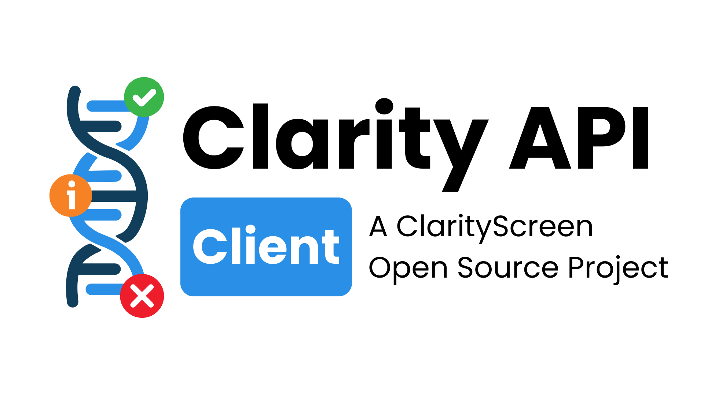

<!--
This README describes the package. If you publish this package to pub.dev,
this README's contents appear on the landing page for your package.

For information about how to write a good package README, see the guide for
[writing package pages](https://dart.dev/guides/libraries/writing-package-pages).

For general information about developing packages, see the Dart guide for
[creating packages](https://dart.dev/guides/libraries/create-library-packages)
and the Flutter guide for
[developing packages and plugins](https://flutter.dev/developing-packages).
-->



The offical, easy-to-use client for ClarityScreen's ClarityAPI, supporting powerful features such as request caching and offline support.

Used in the offical ClarityScreen App.

*Note: ClarityAPI isn't accepting external users yet, but we'll be expaning soon. This is mainly an internally-used project for our offical app as of now.*

## Features

- Support for Flutter
- Support for barebones Dart
- Endpoint customisation (for self-hosted ClarityAPI instances)
- Integration with Firebase API for token generation
- Support for request caching to keep request numbers down
- Continues seamlessly from the cache when offline

## Getting started

Depend on the package in your `pubspec.yaml`

```yaml
dependencies:
    clarity_api_client:
        git:
            url: https://github.com/IntegralPilot/clarity_api_client.git
```

## Usage

ClarityScreen-ers, please refer to the ClarityAPI repository.

We're working on public documentation for ClarityAPI, please hang tight!

## Additional information

Maintained by IntegralPilot from the ClarityScreen team.